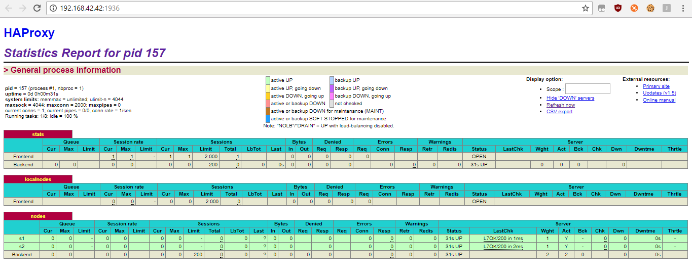
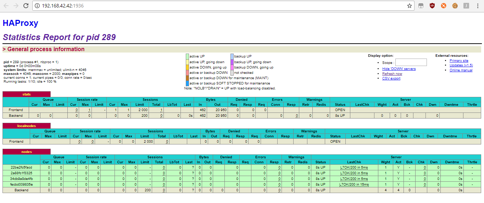
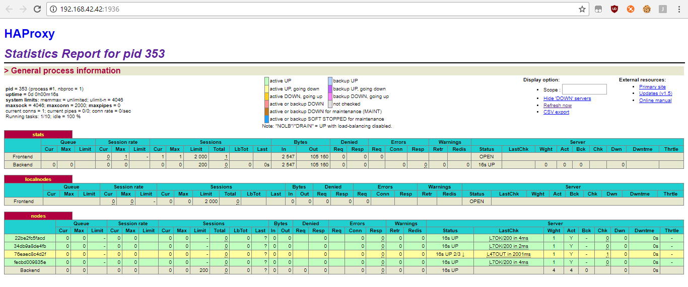
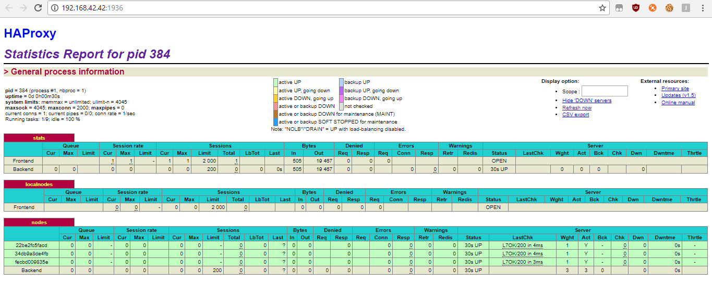

## Lab 04 - Docker
#### Authors
* HARBAOUI Yosra
* DONGMO NGOUMNAI Annie Sandra

#### Pedagogical objectives
* Build our own Docker images
* Become familiar with lightweight process supervision for Docker
* Understand core concepts for dynamic scaling of an application in production
* Put into practice decentralized management of web server instances

#### Table of contents
0. [Identify issues and install the tools](#task-0)
1. [Add a process supervisor to run several processes](#task-1)
2. [Add a tool to manage membership in the web server cluster](#task-2)
3. [React to membership changes](#task-3)
4. [Use a template engine to easily generate configuration files](#task-4)
5. [Generate a new load balancer configuration when membership changes](#task-5)
6. [Make the load balancer automatically reload the new configuration](#task-6)

### Introduction
### Task 0: Identify issues and install the tools
1. <a name="M1"></a>**[M1] Do you think we can use the current
   solution for a production environment? What are the main problems
   when deploying it in a production environment?**  
    No, the current solution can't be used in a prod environment.In fact, we cannot dynamically add and remove web servers, and the reconfigurtion of the HAProxy have to be manually ( if a webb server is added or removed or crashed).

2. <a name="M2"></a>**[M2] Describe what you need to do to add new
   `webapp` container to the infrastructure. Give the exact steps of
   what you have to do without modifiying the way the things are
   done. Hint: You probably have to modify some configuration and
   script files in a Docker image.**  
   We modified the configuration script files:

   - Update files in the ``ha/scripts`` directory:
   * In the ``run.sh`` files, we added the following command:   
   ``sed -i 's/<s3>/$S3_PORT_3000_TCP_ADDR/g' /usr/local/etc/haproxy/haproxy.cfg``  

 - In the ``ha/config/haproxy.cfg`` file, we Added the command  
 ``server s3 <s3>:3000 check``

 - In the ``start-containers.sh``  file, we added :
 ``docker run -d --name s3 softengheigvd/webapp``

 - Rebuild the image of ha:  
  ``cd /vagrant/ha``  
  ``docker build -t softengheigvd/ha .``

 - Stop and force to remove the containers :  
  ``docker rm -f s1 s2 ha``

 - Start the containers:  
 ``docker run -d --name s1 softengheigvd/webapp``  
 ``docker run -d --name s2 softengheigvd/webapp``  
 ``docker run -d --name s3 softengheigvd/webapp``  
 ``docker run -d -p 80:80 -p 1936:1936 -p 9999:9999 --link s1 --link s2 --link s3 --name ha softengheigvd/ha``

3. <a name="M3"></a>**[M3] Based on your previous answers, you have
   detected some issues in the current solution. Now propose a better
   approach at a high level.**  
   This solution is not the best because all the updates are done manually. Our purpose is updating automatically. We can we can write  scripts to update and to run automatically our HAProxy when a node is added or removed from the infrastructure.

4. <a name="M4"></a>**[M4] You probably noticed that the list of web
  application nodes is hardcoded in the load balancer
  configuration. How can we manage the web app nodes in a more dynamic
  fashion?**  
  We are going to see how to manage the web app nodes automatically in this lab.  We can use a tool to manage cluser membership: all containers are in the same cluster et each one of them have to notify the others (in the same cluser) when he arrives or leaves.

5. <a name="M5"></a>**[M5] In the physical or virtual machines of a
   typical infrastructure we tend to have not only one main process
   (like the web server or the load balancer) running, but a few
   additional processes on the side to perform management tasks.**  

   **For example to monitor the distributed system as a whole it is
   common to collect in one centralized place all the logs produced by
   the different machines. Therefore we need a process running on each
   machine that will forward the logs to the central place. (We could
   also imagine a central tool that reaches out to each machine to
   gather the logs. That's a push vs. pull problem.) It is quite
   common to see a push mechanism used for this kind of task.**

   **Do you think our current solution is able to run additional
   management processes beside the main web server / load balancer
   process in a container? If no, what is missing / required to reach
   the goal? If yes, how to proceed to run for example a log
   forwarding process?**  
   It is not possible to run additional management processes beside the main web server / load balancer process in a container using our solution. Docker is designed with ``One process per container``. In order to resolve this problemm we have to install a process supervisor.

6. <a name="M6"></a>**[M6] In our current solution, although the
   load balancer configuration is changing dynamically, it doesn't
   follow dynamically the configuration of our distributed system when
   web servers are added or removed. If we take a closer look at the
   `run.sh` script, we see two calls to `sed` which will replace two
   lines in the `haproxy.cfg` configuration file just before we start
   `haproxy`. You clearly see that the configuration file has two
   lines and the script will replace these two lines.**

   **What happens if we add more web server nodes? Do you think it is
   really dynamic? It's far away from being a dynamic
   configuration. Can you propose a solution to solve this?**  
   If we add more server nodes, we also have to add lines or commands like ``sed`` in the ``run.sh`` script. That's why this solution is not dynamic. To solve this problem, a **template engine** can be helpful because it generates easily configuration files.  

**Deliverables**:
###### 1. Take a screenshot of the stats page of HAProxy at <http://192.168.42.42:1936>. You should see your backend nodes.  
)  
stats page of HAProxy 1.PNG
###### 2. Give the URL of your repository URL in the lab report.
Our repository is [here](https://github.com/yosra-harbaoui/Teaching-HEIGVD-AIT-2016-Labo-Docker)

#### Task 1: Add a process supervisor to run several processes
**Deliverables**:
###### 1. Screenshot of the stats page of HAProxy :  
   

###### 2. Describe your difficulties for this task:  
There is only a single process running inside a container. That's why, the container will run only when the process is running and when the process stops, the container automatically stops. To solve this problem, we need to run several processes at the same time in a container by using a **process supervisor** : we installed an init system called ``s6`` in the HAProxy and the and Web application Docker files, and we configure it as our main process replacing the current one.

In order to use this solution we created a folder ``services`` in HAProxy and Webb application where we copied the scripts for ``s6``.

### Task 2: Add a tool to manage membership in the web server cluster  
**Deliverables**:  
###### 1. Provide the docker log output for each of the containers: ``ha``, ``s1`` and ``s2``.  
You can find these logs here:  
[ha](logs\task2\ha.logs)  
[s1](logs\task2\s1.logs)  
[s2](logs\task2\s2.logs)  

###### 2. Give the answer to the question about the existing problem with the current solution.  

The problem here is the way we create the serf cluster. In fact, first, we start ``ha``, then ``s2`` and ``s1``.``ha`` creates a cluster, then ``s1`` and ``s2`` join this cluster through our ``ha``. If ``ha`` leaves the cluster, all the other nodes can not join the cluster anymore.  

An optional solution is using a decentralized architecture: Serf. In fact, when a new node is created, a link to the last node that have joined the cluster.


###### 3. Give an explanation on how ``Serf`` is working. Read the official website to get more details about the ``GOSSIP`` protocol used in ``Serf``. Try to find other solutions that can be used to solve similar situations where we need some auto-discovery mechanism.
Serf is a decentralized cluster membership management tool. It links the container up or down.  
Serf uses a protocol named ``GOSSIP`` to send broadcast messages between the nodes in the cluster .  
In fact, a node can start a new cluster or join an existing one. If he starts a new cluster, additional nodes are expected to join it by giving the address of at least one existing members. The new member does a full state sync with the existing member over TCP and begins gossiping its existence to the cluster.  
**reference:** <https://www.serf.io/docs/internals/gossip.html>  
### Task 3: React to membership changes  
**Deliverables**:
###### 1.Provide the docker log output for each of the containers: ``ha``, ``s1`` and ``s2``.
You can find these logs here:  
[ha running only](logs\task3\ha.logs)  
[s1 : one of the backend](logs\task2\s1.logs)  
[ha after running s1](logs\task3\ha_b.logs)  
[s2](logs\task2\s2.logs)
###### 2. Provide the logs from the``ha`` container gathered directly from the ``/var/log/serf.log`` file present in the container.
You can find these logs here:  
[/var/log/serf.log](logs\task3\in_ha.logs)  
### Task 4: Use a template engine to easily generate configuration files
**Deliverables**:
###### 1. You probably noticed when we added `xz-utils`, we have to rebuild the whole image which took some time. What can we do to mitigate that? Take a look at the Docker documentation on [image layers](https://docs.docker.com/engine/userguide/storagedriver/imagesandcontainers/#images-and-layers). Tell us about the pros and cons to merge as much as possible of the command. In other words, compare:

  ```
  RUN command 1
  RUN command 2
  RUN command 3
  ```

  vs.

  ```
  RUN command 1 && command 2 && command 3
  ```

  A Docker image is referenced like a set of layers, a new layer is added if a new command is executed.  
  In the first example, 3 layers are added to our Docker image. This approach  executes each command independently.
  In the second one, just one layer is added.  
  Besides, if ``RUN command 1`` fails to execute, ``RUN command 2`` and ``RUN command 3`` will not be executed neither. This approach can facilitate the building of our image.
  In order to reduce the size of our docker image, we can use ``docker-squash``.   
 Reference : <https://github.com/jwilder/docker-squash>

###### 2. Propose a different approach to architecture our images to be able to reuse as much as possible what we have done. Your proposition should also try to avoid as much as possible repetitions between your images.
Docker decides that a particular layer needs to be rebuilt when we do a ``docker build``. These can affect our Docker image cache. A solution is to maximize Your Docker image caching unsing some techniques referenced here <https://www.ctl.io/developers/blog/post/more-docker-image-cache-tips/>

###### 3. Provide the ``/tmp/haproxy.cfg`` file generated in the ``ha`` container after each step. Place the output into the logs folder like you already did for the Docker`` logs`` in the previous tasks. Three files are expected.
You can find these logs here:  
[ha](logs\task4\in_ha_a.logs)  
[ha after running s1](logs\task4\in_ha_b.logs)  
[ha after running s2](logs\task4\in_ha_c.logs)

**In addition, provide a log file containing the output of the ``docker ps`` console and another file (per container) with ``docker inspect <container>``. Four files are expected.**
You can find these logs here:  
[docker ps](logs\task4\dockerPs.logs)  
[docker inspect ha](logs\task4\ha_Inspect.logs)  
[docker inspect s1](logs\task4\s1_Inspect.logs)  
[docker inspect s2](logs\task4\s2_Inspect.logs)

###### 4. Based on the three output files you have collected, what can you say about the way we generate it? What is the problem if any?
The configuration file ``/tmp/haproxy.cfg`` is a temporary file that contain only the last container has joined the cluster. It does not append the information, it ereases information of the previous node to replace it with those of the last one.
The problem is that we cannot keep information about all nodes of the cluster in the same file.

### Task 5 : Generate a new load balancer configuration when membership changes
**Deliverables**:
###### 1. Provide the file ``/usr/local/etc/haproxy/haproxy.cfg`` generated in the ha container after each step. Three files are expected.
You can find these logs here:  
[ha](logs\task5\in_ha_a.logs)  
[ha after running s1](logs\task5\in_ha_a.logs)  
[ha after running s2](logs\task5\in_ha_a.logs)  

**In addition, provide a log file containing the output of the ``docker ps`` console and another file (per container) with ``docker inspect <container>``. Four files are expected.**  
You can find these logs here:  
[docker ps](logs\task5\docker_ps.logs)  
[docker inspect ha](logs\task5\docker_inspect_ha.logs)  
[docker inspect s1](logs\task5\docker_inspect_s1.logs)  
[docker inspect s2](logs\task5\docker_inspect_s2.logs)  

###### 2. Provide the list of files from the ``/nodes`` folder inside the ``ha`` container. One file expected with the command output.
You can find the list here :  
[list of nodes](logs\task5\list_of_nodes.logs)

###### 3. Provide the configuration file after you stopped one container and the list of nodes present in the ``/nodes`` folder. One file expected with the command output. Two files are expected.
You can find the logs here:  
[ha after stooping s1](logs\task5\in_ha_after_s1_stopped.logs)  
[list of nodes after stopping s1](logs\task5\list_of_nodes_after_s1_stopped.logs)  

**In addition, provide a log file containing the output of the ``docker ps``console. One file expected.**  
You can find the output of ``docker ps`` here:   
[docker ps](logs\task5\docker_ps_after_s1_stopped.logs)  

### Task 6 :  Make the load balancer automatically reload the new configuration
**Deliverables**:
###### 1. Take a screenshots of the HAProxy stat page showing more than 2 web applications running. Additional screenshots are welcome to see a sequence of experimentations like shutting down a node and starting more nodes.

After starting 4 nodes, we have the follwing result:  
  

You can find the ``docker ps`` file here:  
[docker ps after strating 4 apps](logs\task6\docker_ps_4_apps.logs)

After stopping s1 node, we can see the following result:  


  

You can find the ``docker ps`` file here:  
[docker ps after strating 4 apps](logs\task6\docker_ps_s1_stopped.logs)  

###### 2. Give your own feelings about the final solution. Propose improvements or ways to do the things differently. If any, provide references to your readings for the improvements.

The final solution of this lab is working well.  
However, while trying to have more than a just one ``Backend node``, the session does not increment.  
Besides, it will be better to use a solution implementing ``clustering architecture`` like ``Docker Swarm``.
You can learn more about it [here](https://docs.docker.com/engine/swarm/)


### Conclusion
This lab was very instructive. First, it helped us to be more familiar with  lightweight process supervision for Docker. Second, it presented to a new core concepts for dynamic scaling of an application in production. Finally, we succeed to put into practice decentralized management of web server instances like ``Serf``.
